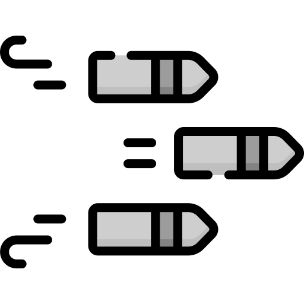

<p align="center">
  
</p>

这是 [摸鱼派客户端](https://github.com/imlinhanchao/fishpi-desktop) 消息弹幕扩展，可以将消息转为弹幕。

## 安装方式

1. 下载 [Release](https://github.com/csfwff/fishpi-ext-danmu/releases) 最新版本的压缩包。
2. 解压缩到客户端扩展目录。
3. 重新开启客户端即可。

## 功能说明
将聊天室消息转为弹幕发送到屏幕上，完全不影响~~摸鱼~~工作

> 默认会显示在主荧幕上，且覆盖基本全屏，按下快捷键 `Win + Shift + F1` 即可拖动，再按一次快捷键将会重新变为不可点击的状态。

> 可以在设置中打开显示边框，方便进行缩放和移动位置

> 按下快捷键 `Win + Esc` 可以快速隐藏和显示弹幕

> ~~可以在设置中开启输入框，快捷发送消息~~目前不建议开启，有bug

> 拖动输入框的🍓，可以移动输入框的位置


## 调试说明
1. 首先，将代码 clone 到扩展目录，运行 `npm run serve`，启动 vue 服务。
2. 添加 `--dev` 命令行参数启动程序：
```bash
# Windows
.\fishpi.exe --dev

# MacOS
fishpi.app/Contents/MacOS/fishpi --dev
```
1. 点击扩展界面的扩展设置按钮。即可启动对扩展 `webview` 调试。